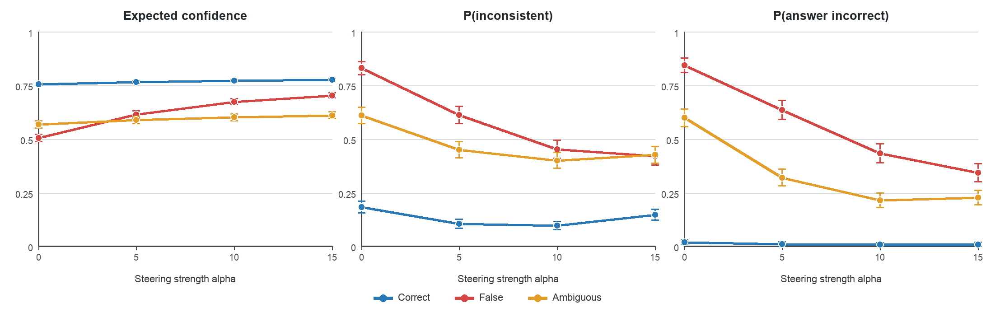

# Causal Confidence Steering Suppresses Metacognitive Error Detection

This repository contains the code and frozen artifacts for a causal intervention
study of metacognitive error detection in `Qwen/Qwen2.5-7B-Instruct`.

The experiment holds a question and answer fixed, adds a high-confidence direction
to the residual stream at the post-answer newline (PANL), and measures whether the
model reports inconsistency, unusualness, error, confidence, or abstention. Increasing
the confidence direction raised reported confidence while suppressing inconsistency
and error detection, especially for false answers.

## Main result

At the strongest validated dose (`alpha = 15`), expected confidence for false answers
increased by `+0.198` (95% CI `[0.168, 0.229]`), while `P(inconsistent)` decreased by
`-0.409` (`[-0.484, -0.334]`) and `P(incorrect)` decreased by `-0.500`
(`[-0.583, -0.416]`). The confidence increase occurred for 100/100 false-answer
items; error detection decreased for 99/100.

## Post-hoc response-channel controls

Two controls were added after preliminary review. First, the 100 correct-answer
items were extended through `alpha = -15, -10, -5`, then joined to their frozen
`alpha = 0, 5, 10, 15` observations. Expected confidence increased from `0.584`
to `0.778` across the full signed sweep. Exact inconsistency log-odds decreased
from `5.791` to `-4.402`, and error-detection log-odds decreased from `7.249` to
`-8.995`. All 100 items had negative full-range alarm slopes.

Second, two matched Yes/No probes reversed only the question polarity. On false
answers, `alpha = 15` decreased Yes log-odds by `-3.868` when Yes meant
inconsistent, but increased them by `+2.611` when Yes meant consistent. The paired
polarity interaction was `+6.479` (95% CI `[5.841, 7.116]`). This rules out a
literal default-No response bias and, together with the signed sweep, rules out a
direction-agnostic perturbation-magnitude account. These controls are post-hoc and
do not establish that the direction encodes only confidence rather than a broader
confidence/commitment-related stance.

Aggregate results are in [results/control](results/control); the raw stimulus-bearing
rows remain withheld under the repository's data policy.



## Frozen scientific contract

- Model: `Qwen/Qwen2.5-7B-Instruct`
- Revision: `a09a35458c702b33eeacc393d103063234e8bc28`
- Architecture: 28 layers, hidden size 3,584
- Inference: evaluation mode, greedy decoding, no sampling
- PANL: tokenizer-derived newline token ID `198`
- Steering site: post-block residual stream, layer 15, PANL
- Direction: mean PANL residual for 25 correct `Likely` TriviaQA trials minus the
  mean for 25 correct `Unlikely` trials, scaled to 3% of the mean residual norm
- Doses: `alpha = 0, 5, 10, 15`
- Stimuli: 100 definite-correct, 100 definite-false, and 100 ambiguous
- Measures: categorical confidence, forced inconsistency, continuous unusualness,
  explicit error detection, and wager/abstention
- Final observations: 6,000 rows across 60 complete cells

## Repository map

```text
configs/       Frozen model and extraction configuration
src/           Platform-neutral model, steering, curation, and experiment code
scripts/       Command-line pipeline and analysis entrypoints
data/          Confidence direction plus stimulus provenance and checksums
results/       Compact final analysis and validation reports
figures/       Reproducible figures used in the paper
tests/         Deterministic protocol and data-contract tests
modal_app.py   Modal deployment and GPU entrypoints
docs/          Methodology, provenance, and reproduction instructions
```

The historical Lightning implementation, provider-migration machinery, model caches,
failed pilots, unused candidates, and paper-generation code are intentionally absent.
See [MANIFEST.md](MANIFEST.md) for the inclusion decisions.

## Installation

Create an environment and install the pinned experiment dependencies:

```bash
python3 -m venv .venv
.venv/bin/pip install -r requirements.lock.txt
```

The plotting script has one additional lightweight dependency:

```bash
.venv/bin/pip install -r requirements-analysis.txt
```

Authenticate Modal once using `modal setup`. Qwen2.5-7B-Instruct is public. An
optional Hugging Face token can be supplied through a Modal secret; credentials are
never read from repository files.

## Run the experiment

Validate the package and Modal volumes without allocating a GPU:

```bash
.venv/bin/python -m pytest -q
.venv/bin/modal run modal_app.py::validate_setup
.venv/bin/modal run modal_app.py::validate_introspection_runner
```

Launch or safely resume the frozen primary run:

```bash
.venv/bin/modal run modal_app.py::run_introspection_experiment \
  --run-name panl-introspection-100x3-v1 \
  --alphas 0,5,10,15 \
  --measures all \
  --batch-size 8
```

The same run name cannot be reused with changed inputs or parameters. A manifest
signature prevents incompatible rows from being mixed.

The two post-hoc control runs use separate immutable run names:

```bash
.venv/bin/modal run modal_app.py::run_introspection_experiment \
  --run-name panl-controls-negative-correct-100-v1 \
  --conditions definite_correct \
  --alphas=-15,-10,-5 \
  --measures confidence_manipulation_check,anomaly_forced_choice,error_detection

.venv/bin/modal run modal_app.py::run_introspection_experiment \
  --run-name panl-controls-polarity-false-100-v1 \
  --conditions definite_false \
  --alphas 0,15 \
  --measures inconsistency_yes_no,consistency_yes_no
```

## Reproduce the analysis

After placing an authorized copy of the raw artifact archive in `results/raw`:

```bash
python3 scripts/analyze_full_introspection_results.py \
  --run-dir results/raw

python3 scripts/plot_results.py \
  --analysis results/raw/full_analysis.json \
  --output-dir figures
```

The analysis validates row counts, run signatures, cell completeness, PANL token
identity, hook application counts, candidate-token validity, continuous parsing, and
fixed response mappings before computing any result.

## Data and large artifacts

Compact numeric results and the confidence direction are versioned in this repository.
The exact stimulus JSONL and raw 21 MB measurement bundle are retained locally but are
not distributed while the source-dataset redistribution terms are being clarified.
The locally prepared archive is:

```text
causal-confidence-steering-v1.0-artifacts.tar.gz
SHA-256: e7b26555193ec9d4d9377411d7d1d7c85cdf83e6b701bb0f9489ff9cb84de310
```

The archive must not be uploaded to a release until redistribution permission has been
confirmed. Its checksum is recorded so an authorized copy can be identified exactly.

## Interpretation boundary

The experiment establishes causal control of behavioral metacognitive reports by a
PANL confidence-related direction. It does not establish consciousness, subjective
feeling, a unique scalar confidence variable, or the absence of an unobserved
provenance signal. The injected direction may jointly influence multiple
commitment-related computations.

## Citation

Citation metadata is provided in [CITATION.cff](CITATION.cff). An archival DOI may be
added in a later release.

## License

The software is released under the [MIT License](LICENSE). This license does not apply
to third-party datasets or dataset-derived text. See [NOTICE.md](NOTICE.md); those
stimulus files and the raw archive are deliberately not distributed here.
